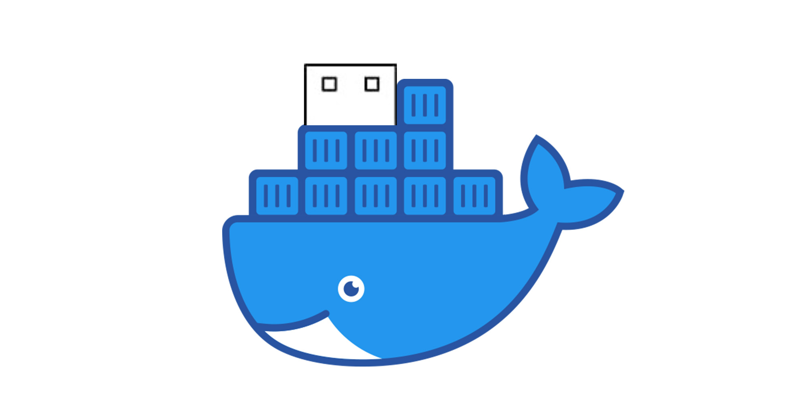

<!-- markdownlint-configure-file { "MD004": { "style": "consistent" } } -->
<!-- markdownlint-disable MD033 -->

# VentoyDocker

<p align="center">
  
  <br>
  <strong>Run Ventoy via Docker</strong>
</p>

<!-- markdownlint-enable MD033 -->

VentoyDocker runs [Ventoy](https://www.ventoy.net/) inside a Docker container so macOS users can create Ventoy bootable USB drives without a native Ventoy build.

## Support Status

| Interface | Status |
| --- | --- |
| Ventoy CLI | Supported |
| VentoyWeb | Supported |
| Ventoy GUI | Not supported |

Linux users can run Ventoy natively. See the official [Ventoy getting started documentation](https://www.ventoy.net/en/doc_start.html).

## Tutorial

[](https://youtu.be/70btP4Nli1w?si=pVojLN-cwY4qmqzo)

## Prerequisites

- macOS
- Docker
- QEMU, including `qemu-nbd`
- A USB drive to install Ventoy on

Install QEMU with Homebrew:

```bash
brew install qemu
```

## Quick Start

> **Warning**
> Ventoy installation can erase or repartition the selected USB drive. Double-check the device path before running these commands.

1. Clone the repository:

   ```bash
   git clone https://github.com/Mr-Sunglasses/VentoyDocker.git
   cd VentoyDocker
   ```

2. Make the host scripts executable:

   ```bash
   chmod +x StartVentoy.sh StartNbd.sh
   ```

3. Find the USB device path:

   ```bash
   diskutil list
   ```

   Use the whole external disk path, for example `/dev/disk5`, not a partition such as `/dev/disk5s1`.

4. Start the NBD server on macOS:

   ```bash
   sudo ./StartNbd.sh -d /dev/disk5
   ```

5. In a second terminal, start the Ventoy Docker container:

   ```bash
   ./StartVentoy.sh
   ```

6. Inside the container, connect to the NBD device:

   ```bash
   ./scripts/mount.sh
   ```

7. Run Ventoy CLI commands or start VentoyWeb.

  - To start VentoyWeb:
    ```bash
    ./VentoyWeb.sh -H 0.0.0.0
    ```

  - To run Ventoy CLI commands:
    ```bash
    ./Ventoy2Disk.sh <commands>
    ```

8. Before leaving the container, detach the NBD device:

   ```bash
   ./scripts/cleanup.sh
   ```

## Workflow Details

### 1. Select the USB Device

Run:

```bash
diskutil list
```

Example output:

```text
/dev/disk0 (internal, physical):
   #:                       TYPE NAME                    SIZE       IDENTIFIER
   0:      GUID_partition_scheme                        *500.3 GB   disk0
   1:             Apple_APFS_ISC Container disk1         524.3 MB   disk0s1
   2:                 Apple_APFS Container disk3         494.4 GB   disk0s2
   3:        Apple_APFS_Recovery Container disk2         5.4 GB     disk0s3

/dev/disk5 (external, physical):
   #:                       TYPE NAME                    SIZE       IDENTIFIER
   0:     FDisk_partition_scheme                        *30.8 GB    disk5
   1:               Windows_NTFS Ventoy                  30.7 GB    disk5s1
   2:                       0xEF                         33.6 MB    disk5s2
```

In this example, the USB drive is `/dev/disk5`.

### 2. Start NBD on the Host

`StartNbd.sh` exports the selected USB device from macOS over NBD.

```bash
sudo ./StartNbd.sh -d /dev/disk5
```

The script requires `sudo` because it needs access to the block device. It also unmounts the selected disk before starting `qemu-nbd`.

By default, NBD listens on port `10809`. To use a custom port:

```bash
sudo ./StartNbd.sh -d /dev/disk5 -p 1088
```

### 3. Start the Ventoy Container

Run:

```bash
./StartVentoy.sh
```

The script builds the Docker image if needed and starts an interactive container.

VentoyWeb is exposed on host port `24680` by default. To use a custom host port:

```bash
./StartVentoy.sh -p 8080
```

### 4. Connect the Container to NBD

Inside the Docker container, mount the exported USB device:

```bash
./scripts/mount.sh
```

This connects `host.docker.internal:10809` to `/dev/nbd0`.

For a custom NBD port or NBD device:

```bash
./scripts/mount.sh -p 1088 -d /dev/nbd1
```

You can also run the underlying command directly:

```bash
nbd-client host.docker.internal 10809 /dev/nbd0
```

### 5. Use Ventoy

From inside the container, use the Ventoy scripts as you normally would. For example, start VentoyWeb with:

```bash
./VentoyWeb.sh -H 0.0.0.0
```

Then open VentoyWeb on the host:

```text
http://localhost:24680
```

If you started the container with a custom host port, use that port instead.

For Ventoy CLI usage, refer to the official [Ventoy documentation](https://www.ventoy.net/en/doc_start.html).

### 6. Detach Cleanly

Before exiting the container, detach the NBD device to avoid data loss:

```bash
./scripts/cleanup.sh
```

For a custom NBD device:

```bash
./scripts/cleanup.sh -d /dev/nbd1
```

You can also run the underlying command directly:

```bash
nbd-client -d /dev/nbd0
```

## FAQ

### How do I run VentoyWeb?

Start the container, connect the NBD device, then run this inside the container:

```bash
./VentoyWeb.sh -H 0.0.0.0
```

Open `http://localhost:24680` on the host. If you used `./StartVentoy.sh -p 8080`, open `http://localhost:8080`.

### Why does `StartNbd.sh` require sudo?

It needs direct access to the selected block device and must unmount the disk before exporting it through `qemu-nbd`.

### Can I use this on Linux?

VentoyDocker is primarily for macOS. On Linux, use Ventoy directly by following the official [Ventoy getting started documentation](https://www.ventoy.net/en/doc_start.html).

## Contributing

Contributions are welcome. Open an issue for bug reports or feature requests, and use the repository templates when submitting pull requests.

## Authors

- [@Mr-Sunglasses](https://www.github.com/Mr-Sunglasses)

## License

This project is licensed under the [MIT License](LICENSE).

## Contributors

Thanks to everyone helping VentoyDocker grow.

[](https://github.com/Mr-Sunglasses/VentoyDocker/graphs/contributors)

## Support

If this project helps you, consider starring the repository.

[](https://forthebadge.com)
